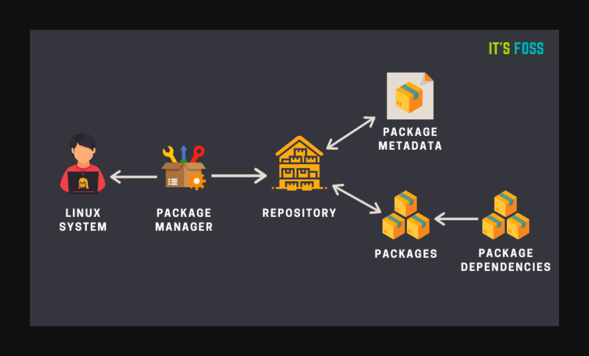
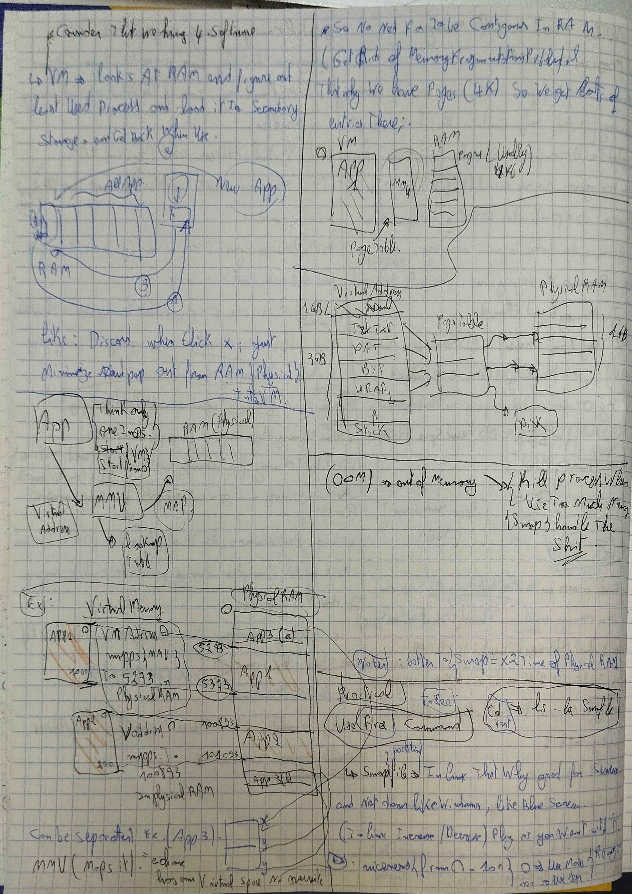

---

## Virtualization 🌐

Virtua lization lets you create virtual versions of physical resources like computers, servers, or storage devices. Think of it like having multiple TVs inside one screen, where each TV shows a different channel and works independently.

### Key Types of Virtualization:

- **Server Virtualization**: Splits one physical server into multiple virtual servers, each with its own operating system (OS) and applications.  
  _Example: Running multiple websites on a single physical server._

- **Desktop Virtualization**: Lets you run a virtual desktop on any device.  
  _Example: Accessing a Windows desktop from a Mac or smartphone._

- **Storage Virtualization**: Combines multiple physical storage devices into one virtual storage unit.  
  _Example: Accessing your data from a single location even though it’s stored on multiple drives._

- **Network Virtualization**: Creates virtual networks on top of physical hardware for better control, flexibility, and security.  
  _Example: Virtual networks in cloud environments that isolate different users' data._

- **Application Virtualization**: Runs applications in a virtual environment, so you don’t need to install them directly on your physical device.  
  _Example: Running a software tool in a browser without installing it on your laptop._

### Benefits of Virtualization 🚀:
- **Cost Savings**: Reduces the need for physical hardware.
- **Efficiency**: Maximizes available resources, making everything run smoother.
- **Flexibility**: Easily create, modify, or delete virtual resources as needed.
- **Isolation**: Each virtual environment operates independently, improving security and stability.


### Real-Life Examples 💡:
- **Virtual Machines (VMs)**: Tools like VMware, VirtualBox, and Hyper-V let you run multiple operating systems on a single machine.
- **Cloud Computing**: Services like AWS, Google Cloud, and Microsoft Azure use virtualization to scale resources dynamically.

---

## Hypervisor 🖥️

A **hypervisor** is software that makes virtualization possible. It creates and manages virtual machines (VMs).

### Types of Hypervisors:

- **Type 1: Bare-Metal Hypervisor**: Runs directly on hardware without a host OS, offering better performance.  
  _Example: VMware vSphere, Microsoft Hyper-V._

- **Type 2: Hosted Hypervisor**: Runs on top of a host OS, easier to set up but with slight performance overhead.  
  _Example: Oracle VirtualBox, VMware Workstation, Parallels for Mac._

### Hypervisor Functions:

- **Resource Allocation**: Distributes hardware resources (CPU, memory) to each VM.
- **Isolation**: Keeps VMs independent, so a crash in one doesn't affect others.
- **Hardware Emulation**: Simulates hardware for each VM (network cards, storage).
- **Management Tools**: Interfaces to create, delete, and configure VMs.

### Why Hypervisors Matter 🧐:
Hypervisors are the backbone of virtualization, which enables:
- **Cloud computing**: Dynamic, scalable cloud resources.
- **Server Consolidation**: Running multiple servers on a single physical machine.
- **Cost-Effective Management**: Running multiple operating systems on one machine for testing, development, and security purposes.


---

## Kernel 🧠

The **kernel** is the heart of an operating system (OS). It acts as a bridge between the hardware (CPU, memory, storage) and the software (applications). The kernel is responsible for managing the system’s resources, including processing tasks, handling memory, managing devices, and organizing file systems.


### Explanation:


### Real-Life Analogy:
Think of the kernel like the **traffic controller** at a busy airport. It directs all the planes (hardware resources) to their correct gates (applications) efficiently, ensuring everything runs smoothly without collisions.

### Key Functions of the Kernel:
- **Resource Management**: Allocates CPU time, memory space, and manages I/O devices.
- **System Security**: Controls access to system resources to ensure safe and secure operations.
- **Hardware Abstraction**: Allows applications to interact with hardware without needing to know the specifics of each device.


it is the first that loads into memoryand last that pop out of memory by systemD
check below about Booting process. and what happends until u see the login thing;

---

## Debian vs. Rocky Linux ⚙️

### 1. **Origin and Purpose**:

- **Debian**:  
  - **Origin**: Community-driven project founded in 1993.  
  - **Purpose**: A general-purpose Linux distribution known for its stability.  
  - **Philosophy**: Focuses on **free and open-source software**.  
  - **Example**: Ubuntu, a popular distro, is based on Debian.

- **Rocky Linux**:  
  - **Origin**: Created in 2020 as a community-driven successor to CentOS.  
  - **Purpose**: A **downstream rebuild of Red Hat Enterprise Linux (RHEL)**, designed for enterprise use.  
  - **Philosophy**: Focuses on **enterprise stability** and **RHEL compatibility**.  
  - **Example**: Often used in cloud environments and enterprise servers as a free alternative to RHEL.

---

### 2. **Target Audience**:

- **Debian**:  
  - **Audience**: Developers, home users, servers.  
  - **Use Case**: Versatile for desktops, servers, development environments, and custom distros like **Ubuntu**.

- **Rocky Linux**:  
  - **Audience**: Primarily aimed at **enterprises and organizations**.  
  - **Use Case**: Ideal for **enterprise servers**, cloud setups, and **production environments**.

---

### 3. **Security and Stability**:

- **Debian**:  
  - **Security**: Focuses on **stability** with thorough testing, meaning updates may be slower.  
  - **Stability**: Extremely reliable, especially in its **Stable** branch.

- **Rocky Linux**:  
  - **Security**: Delivers **timely patches** and **enterprise-grade security**, in line with RHEL’s release cycle.  
  - **Stability**: Tailored for high stability in **production environments**.

---

### **Feature Comparison**:

| Feature            | **Debian**                   | **Rocky Linux**                 |
|--------------------|------------------------------|---------------------------------|
| **Base**           | Independent                  | Downstream of RHEL              |
| **Package Manager**| APT (.deb)                   | dnf/yum (.rpm)                  |
| **Focus**          | General-purpose users        | Enterprise and server environments |
| **Stability**      | Stable but versatile         | Enterprise-grade stability      |
| **Release Cycle**  | Flexible (2-3 years per stable release) | Matches RHEL (predictable)     |
| **Support**        | Community-driven (limited commercial) | Enterprise-level, long-term support |
| **Target Cycle**   | Developers, home users, custom distros | Enterprises and production workloads |

---

### Real-Life Example 🖥️:
If you're running a **personal project** or need a **custom environment**, **Debian** is a great choice for its flexibility and wide range of applications. However, if you're managing a **large-scale enterprise server** or **cloud environment** where stability and security are crucial, **Rocky Linux** offers the reliability and support needed for production workloads.

---

Sure! Here's a more concise and friendly paraphrase of the content with some examples and emojis to help you better remember it. I’ve also formatted it for easy inclusion in a GitHub README in markdown.

---

# 🚀 Firewalls: The Guard of Your Network

A **firewall** is like a security guard for your network! It monitors and controls incoming and outgoing traffic based on preset security rules. Its main job is to protect your devices and network from malicious attacks or unauthorized access by acting as a barrier between trusted and untrusted networks. 

## 🛡️ Firewall Basics

- **Packet Filtering**: Firewalls examine network packets (small chunks of data) to ensure they meet specific security rules.
- **Stateful vs Stateless**: Stateful firewalls (like UFW) track the state of active connections, unlike stateless ones, which treat each packet separately.
- **Default Policies**: Define what the firewall should do with traffic by default (allow or block).

## 🔧 How Firewalls Work

1. **Rule-Based Filtering**: Rules decide if a packet should pass or be blocked (e.g., based on IP, ports, or protocols).
2. **Packet Inspection**: Firewalls inspect data packets and decide whether to allow them based on these rules.
3. **Stateful Inspection**: Tracks connections to ensure packets belong to an active connection, offering better security and context.
4. **Application Awareness**: Advanced firewalls can filter based on the app (e.g., HTTP or FTP) and ensure more granular control.

## 🏠 Firewalls in Practice

- **Hardware Firewalls**: Physical devices installed to protect your network (e.g., a router).
- **Software Firewalls**: Installed on devices (e.g., Windows or macOS firewall, or UFW in Linux).
- **Cloud Firewalls**: Protect cloud resources (e.g., AWS Security Groups).

.gif)


## 🔑 Uncomplicated Firewall (UFW)

### What is UFW?

UFW is a simple firewall tool for **Linux** that makes managing firewall rules easy for beginners. It serves as a user-friendly interface for **iptables**, which is more complex.

### Why Use UFW?
- **Simplicity**: Easy to use, even for beginners.
- **Security**: Controls what traffic is allowed on your system.
- **Automation**: Can be used in scripts for automation.
- **Compatibility**: Works on most Linux distributions.

### 🖥️ UFW in Action

1. **Packet Filtering**: UFW checks data packets based on rules like IP, ports, and protocols.
2. **Stateful Inspection**: Tracks the state of connections, allowing UFW to remember ongoing sessions and permit related traffic without new rules.
3. **Security**: UFW automatically handles return packets, blocking unauthorized ones.

#### UFW Command Examples:
```bash
sudo ufw enable            # Activate UFW firewall
sudo ufw status            # Check UFW status
sudo ufw allow 80/tcp      # Allow web traffic (port 80)
sudo ufw deny 22/tcp       # Block SSH traffic (port 22)
```

### 🔄 UFW Backend and Architecture

UFW translates commands into **iptables** rules and utilizes **Netfilter** for packet filtering. Here's the architecture:
```
UFW CLI → UFW Backend → iptables → Netfilter
```
"look up for the kernal achie that i wrote and check kernal for more."


### 🔥 How UFW Works:
UFW makes it easy to define simple rules that iptables follows using its **stateful packet filtering** system, tracking the state of active connections. This prevents unnecessary complex configurations and enhances security by ensuring only authorized packets are allowed.

## 🧰 Understanding iptables & Netfilter

- **iptables**: This is the tool that **UFW** and other firewalls use to manage rules. It organizes rules into **tables** and **chains**.
- **Netfilter**: The underlying framework that handles all packet filtering, NAT (Network Address Translation), and connection tracking on Linux.

### Example Use Cases:
- **Packet Filtering**: Decide if packets should be accepted or blocked (e.g., block suspicious traffic).
- **Connection Tracking**: Track the state of active connections to only allow responses to authorized requests.
- **NAT**: Modify IP addresses for routing purposes (e.g., forwarding a port from your router to your local machine).

---

**Real-life example**: Think of a firewall like a **club bouncer**. The bouncer checks who’s entering (or leaving) the club (network) and makes sure they meet certain criteria, like showing an ID (matching IP/port rules). If someone is on the guest list (rules), they’re allowed in; if not, they’re sent away! 🎉

---

# 🚀 **SSH (Secure Shell) & Ports - An Overview** 🌐

## 🌟 **What is SSH?**
SSH (Secure Shell) is a protocol that enables secure remote access to systems over an unsecured network.

### 🔐 **Key Features of SSH:**
- **Remote Login & Command Execution**: SSH allows users to securely log into servers, execute commands, and manage files. Think of it as a secure remote control for your server.
- **Security**: It uses encryption to protect against hackers and eavesdropping. 🔒
- **File Transfers**: Tools like SCP and SFTP enable secure file transfers using SSH. 📁


### 💡 **Why Use SSH?**
- **Security**: Encrypted communication to prevent data breaches.
- **Remote Management**: Administrators can manage servers from anywhere.
- **File Transfers**: Securely move sensitive files across networks.

---

## 🖥️ **How SSH Works:**
- **Client-Server Model**:
  - **Client**: Initiates the connection.
  - **Server**: Listens for incoming connections.
  
- **Process**:
  1. **Connection**: The client connects to the server (usually port 22). 🖱️
  2. **Key Exchange**: The client and server exchange cryptographic keys to set up a secure channel. 🔑
  3. **Authentication**: The server verifies the client using passwords or keys.
  4. **Secure Communication**: Encrypted commands and data are exchanged. 🛡️


---

## 📑 **Ports: What Are They?**
Ports allow devices to identify and separate different types of network traffic. They’re like "doors" through which specific services communicate.

### 🔑 **How Ports Work:**
- **IP + Port**: Think of it as an address + apartment number.
  - Example: `192.168.1.10:22` 
    - **IP address**: 192.168.1.10 (your "address").
    - **Port number**: 22 (the "door" for SSH).

- **Protocols & Ports**:
  - **TCP**: Reliable, connection-oriented communication. 🔄
  - **UDP**: Fast but less reliable. ⚡

---

### 🏷️ **Types of Ports:**
- **Well-Known Ports (0–1023)**: Reserved for system services (e.g., `80` for HTTP, `443` for HTTPS, `22` for SSH). 🌍
- **Registered Ports (1024–49151)**: Used by specific apps or organizations (e.g., `3306` for MySQL). 💻
- **Dynamic Ports (49152–65535)**: Temporary ports used by clients when connecting to servers (like a random seat on a bus). 🚌

---

## 🌐 **Port Ranges Explained:**
### 1. **Why Clients Use Dynamic Ports**:
- **Avoid Conflicts**: Clients use random ports to avoid conflicts between multiple connections.
- **Temporary**: These ports are only used during the connection and are freed afterward.

### 2. **Example - How Connections Work**:
- **Client Sends a Request**: 
  - Source: `192.168.1.2:50234`, Destination: `203.0.113.5:80` (for HTTP).
- **Server Responds**: 
  - Source: `203.0.113.5:80`, Destination: `192.168.1.2:50234`.
  
Even if two clients visit the same site, each will use a different source port to maintain separate connections. 🌐

---

## 🔍 **Real-World Example:**
Imagine opening two tabs in your browser. Both tabs visit the same website on port 443 (HTTPS), but each uses a different source port to avoid mixing up the connections.

- **Tab 1**: `192.168.1.2:50234 → 203.0.113.5:443`
- **Tab 2**: `192.168.1.2:50235 → 203.0.113.5:443`

This ensures that both tabs remain distinct even though they’re accessing the same server! ✨

---

### 🖧 **How a Server Handles Ports**:
A server only opens the ports it needs. For example:
- **Web Server**: Ports `80` (HTTP) and `443` (HTTPS) are open.
- **SSH Server**: Port `22` is open for remote connections.

Any ports not actively in use (like `21` for FTP or `3306` for MySQL) will be **closed**. 🔒

---

### 🎯 **In Conclusion:**
- SSH ensures secure communication for managing remote systems. 💻🔐
- Ports help devices organize network traffic and allow different services to run on the same device. 🔌
- Servers listen on specific ports to handle incoming connections, while clients use dynamic ports to initiate their own connections.

---

## 📦 Package Manager

A **package manager** is a tool that automates the installation, upgrade, configuration, and removal of software on your system. It simplifies the management of software (like apps and libraries) by handling dependencies, version control, and repository access. Think of it like a personal assistant for managing all your software packages! 🧑‍💻

### Key Functions of a Package Manager:

- **Install Software:** Downloads and installs packages along with their required dependencies.
- **Update Software:** Keeps your software up-to-date with one simple command.
- **Remove Software:** Uninstalls software and cleans up unused dependencies.
- **Dependency Management:** Automatically installs required libraries or tools when needed.
- **Repository Management:** Accesses software repositories and lets you add or remove repositories.
- **Version Control:** Tracks installed versions and allows you to install specific versions.
- **Search & Query:** Search for software in repositories or view details about installed packages.

### How It Works:
1. **Repositories**: Software is stored in repositories (like a warehouse), which are accessed by the package manager. 📂
2. **Package Files**: Software is packaged into files that include binaries, metadata, and configuration info. 📦
3. **Dependency Resolution**: When installing, the package manager checks for required dependencies and installs them if missing.
4. **User Commands**: You interact with the package manager using commands like:
   - `apt install <package>` (Debian/Ubuntu)
   - `dnf install <package>` (Fedora)
   - `brew install <package>` (macOS)


### Types of Package Managers:
1. **Low-Level Package Managers**: Manage individual package files (e.g., `dpkg` for Debian, `rpm` for Red Hat).
2. **High-Level Package Managers**: Built on top of low-level tools, these handle dependencies automatically (e.g., `apt`, `dnf`, `brew`).

### Popular Package Managers:
- **apt/apt-get** (Debian/Ubuntu): Manages .deb packages.
- **dnf/yum** (Fedora/RHEL): Manages .rpm packages.
- **pacman** (Arch Linux): A lightweight, fast package manager.
- **brew** (macOS/Linux): A versatile package manager for open-source software.
- **npm** (JavaScript): Manages Node.js libraries.
- **pip** (Python): Manages Python libraries.

### Real-Life Example 🌍:
Imagine you're setting up a new system and need various tools—like a text editor, a web browser, or a programming language. Instead of downloading each tool manually, you simply type `apt install <package>` and the package manager handles everything! From finding the right version to downloading and installing dependencies, it saves you time and effort. 🕒

### Package Manager for Debian

Debian uses a combination of **dpkg** (low-level) and **apt** (high-level) for package management. Here’s how it works:

- **dpkg**: Installs, removes, or configures packages manually (e.g., `dpkg -i <package>.deb`).
- **apt**: Automatically handles dependencies and simplifies installation (e.g., `apt install <package>`).

--> simply diff between apt and apptitude is that second can resolve conflict between depencies and resolve it and clean up unwanted dep and has graphical user interface. "no need for these must know what happend undrthehood lookkup abve" 

---

## 🛡️ Encrypted LVM: Secure and Flexible Storage in Linux

Encrypted LVM combines two powerful Linux technologies: **LVM** (Logical Volume Manager) and **disk encryption**, offering both security and flexibility. Let’s break it down with examples and analogies to make it easy to understand. 🚀

---

### 📂 **What is LVM?**
LVM is like a **smart partition manager**. Instead of being restricted by physical disk sizes, it lets you:
- **🛠️ Create, resize, and manage partitions (logical volumes)** dynamically.
- **📦 Group multiple physical disks into one large storage pool** (volume group).

**Real-Life Example:**
Imagine your disk as LEGO bricks:
- 🧱 **Physical Volumes (PVs)** are the individual LEGO bricks.
- 🏗️ **Volume Groups (VGs)** are the structures you build by combining bricks.
- 🏠 **Logical Volumes (LVs)** are rooms in your LEGO structure where data (furniture) is stored.


---

### 🔒 **What is Disk Encryption?**
Disk encryption ensures your data is safe by encrypting it with a secret key. Even if someone steals your disk, they can’t access your files without the key. 🔑

**Real-Life Example:**
Think of encryption as a **password-protected safe**. Only the right combination unlocks it.

---

### 💡 **Why Use Encrypted LVM?**
1. **Security** 🛡️: Protects data even if the disk is stolen.
2. **Flexibility** 🔄: Resize partitions or add more storage without hassle.
3. **Portability** 🚀: Move encrypted disks between systems securely.

---

### 🛠️ **How Encrypted LVM Works**
1. **Physical Volumes (PVs)**: These are your actual disks or partitions (e.g., `/dev/sda1`).
2. **Encryption Layer**: PVs are encrypted using tools like **LUKS**.
3. **Volume Groups (VGs)**: Combine encrypted PVs into a single storage pool.
4. **Logical Volumes (LVs)**: Create user-accessible storage from the VG, which can be formatted and mounted.

---

### 🧱 **Key Components of LVM**
1. **Physical Volume (PV)**: Raw storage (e.g., `/dev/sda`).
   - **Role**: Provides the base for LVM.
   - 🧱 Example: A single hard disk.
2. **Volume Group (VG)**: A collection of PVs, like combining disks into one storage pool.
   - **Role**: Abstracts physical disks for easier management.
   - 🏗️ Example: Combine `/dev/sda` and `/dev/sdb` into `my_vg`.
3. **Logical Volume (LV)**: Usable storage created from the VG.
   - **Role**: Where you store your data.
   - 🏠 Example: Create `home_lv` or `root_lv` for different uses.


---

### 🤔 **Real-Life Analogy**
- PVs: 🧱 Bricks.
- VG: 🏗️ Wall built from bricks.
- LVs: 🪟 Sections of the wall (windows, doors, shelves).
You can:
- Add more bricks (PVs) to extend the wall.
- Modify specific sections (LVs) without affecting the whole structure.

---

### ⚡ Example Scenario: Combining Two Disks
1. **Prepare Disks as PVs**:
   ```bash
   pvcreate /dev/sda
   pvcreate /dev/sdb
   ```
2. **Create a VG**:
   ```bash
   vgcreate my_vg /dev/sda /dev/sdb
   ```
   🎉 Now you have 1.5TB of space (500GB + 1TB).
3. **Create LVs**:
   ```bash
   lvcreate -L 300G -n lv_data my_vg
   lvcreate -L 500G -n lv_backup my_vg
   ```
---

### 🪄 **Benefits of Using Encrypted LVM**
- **Scalability**: Add disks as needed without starting over.
- **Efficiency**: Treat multiple disks as one.
- **Security**: Protect sensitive data effortlessly.

---

### 📝 Key Takeaways
- Use **encrypted LVM** for secure and dynamic storage management.
- It’s like having a flexible storage system that’s **secure by design**. 🏰🔑

---

# 📜 Master Boot Record (MBR): The Starting Point of Your Disk

The **Master Boot Record (MBR)** is like the "table of contents" for your storage device 📚. It's the first thing your computer reads when booting up, located at the very start of the disk (sector 0). 

---

## 🧱 Structure of the MBR

The MBR is just **512 bytes** but contains three critical sections:

1. **Bootloader Code (446 bytes):**  
   🛠️ A tiny program that helps your computer find and load the operating system.  
   **Example:** Think of it as a librarian who checks the catalog and hands you the right book (partition).

2. **Partition Table (64 bytes):**  
   🗂️ Stores details about up to 4 primary partitions, like their type (NTFS, FAT32) and size.  
   **Example:** A seating chart in a theater—each section has its start and size defined.

3. **Boot Signature (2 bytes):**  
   ✅ A magic marker (`0x55AA`) confirming the disk is bootable.  
   **Example:** Like a stamp of approval on your ticket before entering a show.

---

## 🚀 How MBR Works (Step-by-Step)

1. **BIOS Reads the MBR:**  
   When you turn on the computer, the BIOS fetches the MBR from sector 0.  
   **Real-Life Analogy:** Imagine a car's ignition turning on the GPS to find the first route.

2. **Bootloader Executes:**  
   The bootloader checks which partition is active and loads the operating system.  
   **Example:** Like a chef choosing the active burner to start cooking your meal.

3. **Operating System Loads:**  
   Once the OS is loaded, your system is ready to use! 🎉

---

## 🛑 Limitations of MBR

1. **Partition Limit:** Only supports **4 primary partitions** (or 3 + 1 extended).  
2. **Disk Size Limit:** Can handle disks only up to **2 TB**.  
3. **No Redundancy:** If the MBR is corrupted, the disk becomes unreadable.

---

## 🤔 When to Use MBR

- You're working with **older systems** that use BIOS.  
- Your disk is **smaller than 2 TB**.  
- Simpler setups where 4 partitions are enough.  


---


## 🔗 MBR vs GPT (A Quick Comparison)

| Feature               | **MBR**          | **GPT**                  |
|-----------------------|------------------|--------------------------|
| Max Disk Size         | 2 TB            | Practically unlimited 🚀 |
| Max Partitions        | 4 primary       | Up to 128 🗂️             |
| Redundancy            | None            | Multiple backup tables 🔄 |
| Compatibility         | BIOS systems    | UEFI systems            |

### Structure in the Disk


---

💡 **Real-Life Example to Remember MBR:**  
Imagine an old-fashioned library catalog (MBR) with a strict limit on how many books it can reference. Newer systems (GPT) are like a digital catalog—faster, with more storage, and backed up in the cloud! 🌥️

---

## 📁 Filesystems and Directories  

### 🗂 What is a Filesystem?  
A **filesystem** is like an **organizational system** for your storage device. It defines how data is stored, retrieved, and managed on a disk. Think of it as the **index** or **library system** that tells you where each book (data) is stored.  

#### 🌟 Key Features of a Filesystem:  
1. **File Storage**: Stores files in a structured way for easy retrieval.  
2. **Metadata**: Keeps details like file size, type, and permissions.  
3. **Directories**: Organizes files in a hierarchical structure (folders inside folders).  
4. **Access Control**: Manages who can read, write, or execute files.  

#### 📖 Real-Life Analogy:  
Imagine a filesystem as a **bookshelf in a library**:  
- Books (files) are stored in sections (folders/directories).  
- Each book has metadata like title, author, and genre (file properties).  
- The librarian (operating system) uses an index (filesystem) to locate a book quickly.  

#### ⚙️ Examples of Filesystems:  
- **NTFS**: Common on Windows. Supports large files and permissions.  
- **ext4**: Default for Linux, reliable and efficient.  
- **FAT32**: Simple and widely compatible but limited in file size.  
- **APFS**: Optimized for Apple devices.  

---

### 📂 What is a Directory?  
A **directory** is a **virtual folder** that organizes files into a structured hierarchy. Directories can contain files and subdirectories, creating a tree-like structure.  

#### 🌟 Key Features of Directories:  
1. **Hierarchy**: Files are stored in parent and child directories (like a tree).  
2. **Pathnames**: Directories help form file paths (e.g., `/home/user/documents`).  
3. **Organization**: Makes it easy to find and manage files.  

#### 📖 Real-Life Analogy:  
Think of directories as a **filing cabinet**:  
- The cabinet (root directory) contains drawers (subdirectories).  
- Each drawer has folders (subdirectories) and papers (files).  
- Labels (pathnames) help you navigate the cabinet to find the right file.  


#### ⚙️ Examples of Directories:  
- **Root Directory (`/`)**: The top-level directory in Linux/UNIX.  
- **Home Directory (`/home/user`)**: Where personal files are stored.  
- **System Directories**: `/bin`, `/etc`, `/var`, etc., hold system files and configurations.  

- **Swap**:  Swap space acts as virtual memory when the physical RAM is insufficient.


### Explanation




### simple fact
--> must use ext4 is  the latest and has shrinking as well not just growing in lvm.

---

# 🐧 `su`, `sudo`, `crontab`  

## 📜 `su` Command: Switch User  

The **`su`** (substitute user) command lets you switch to another user account, typically to gain superuser (root) privileges. Think of it as "putting on someone else's shoes" to perform tasks as another user.  

### 🔑 Basic Syntax:  
```bash
su [OPTIONS] [USER]
```  
- If no user is specified, `su` defaults to switching to the root user.  

### 🚀 Key Use Cases:  
1. **Switch to Root User:**  
   ```bash
   su
   ```  
   - Prompts for the root password. Once authenticated, you gain root access.  

2. **Switch to Another User:**  
   ```bash
   su username
   ```  
   - Logs in as another user by providing their password.  

3. **Run a Command as Another User:**  
   ```bash
   su -c "command" username
   ```  
   - Runs the specified command as the target user and then returns to the original shell.  

---

### 🛠️ Options:  

1. **`-` or `-l`: Start a Login Shell**  
   - Simulates a full login for the target user, changing the environment and directory to their defaults.  
   - Example:  
     ```bash
     su - username
     ```  

2. **`-c`: Run a Single Command**  
   - Executes a single command as the target user.  
   - Example:  
     ```bash
     su -c "apt update"
     ```  

3. **`-s SHELL`: Specify a Shell**  
   - Switch to a specific shell for the target user.  
   - Example:  
     ```bash
     su -s /bin/bash
     ```  

---

### 🖥️ Real-Life Example:  
- Imagine you’re an IT admin managing multiple user accounts. If you need to check user `john`’s configuration, you can log in as `john` without leaving your session:  
  ```bash
  su - john
  ```  

---

### 🤔 Login Shell vs. Non-Login Shell:  

| Aspect                 | `su username` (Non-Login)      | `su - username` (Login)     |  
|------------------------|--------------------------------|-----------------------------|  
| **Environment**        | Retains current user’s env.    | Loads target user’s env.    |  
| **Working Directory**  | Stays in current directory.    | Switches to home directory. |  
| **Configuration Files**| Does not load login configs.   | Loads `.bash_profile`, etc. |  
| **Use Case**           | Quick tasks.                  | Full user environment setup. |  

---

## 🔒 `sudo` Command: Superuser Do  


The **`sudo`** **`i call it Thanos Hand`** command allows users to run specific commands as another user (usually root) without switching accounts. It’s like getting temporary superpowers but with restrictions.  

### 🔑 What is `sudo`?  
- Stands for **"superuser do"** or **"substitute user do"**.  
- Enhances security by allowing fine-grained control over administrative tasks without exposing the root password.  

### 🚀 Key Use Cases:  
1. **Run a Command as Root:**  
   ```bash
   sudo apt update
   ```  

2. **Edit Files as Root:**  
   ```bash
   sudo nano /etc/hosts
   ```  

3. **Switch to Root User (if permitted):**  
   ```bash
   sudo su
   ```  

---

### 🖥️ Real-Life Example: 

- Imagine a shared work laptop where you don’t want everyone to have full admin rights. Using `sudo`, you can give a specific user permission to install software without giving them full root access.  
- 


-----

## ⏰ `crontab` Command: Automate Tasks  

The **`crontab`** command is your scheduler for repetitive tasks in Linux. It’s like setting reminders for your system to execute commands automatically.  

### 🔑 What is `crontab`?  
- Stands for **"cron table"**.  
- Used to schedule tasks (called cron jobs) at specified times or intervals.  

### 🚀 Basic Syntax:  
```bash
crontab [OPTIONS]
```  
- Use `crontab -e` to edit the current user's cron jobs.  
- Use `crontab -l` to list all cron jobs for the current user.  

### 🔧 Example of a Cron Job:  
Schedule a script to run every day at 3 AM:  
```bash
0 3 * * * /path/to/script.sh
```  


---

Here's a more eye-catching and friendly version:  

---

🎯 **Ready to Master Linux?**  
Explore my ***[Flashcards/](./Flashcards/)*** folder—your ultimate toolkit for learning! 🚀  

✅ **What you'll find:**  
- **Anki Flashcards**: Perfect for spaced repetition, boosting long-term memory! 🧠  
- **Markdown Quick Reviews**: Great for instant recaps anytime, anywhere! 📖  

💡 Mix these with Anki's algorithm for the **best learning experience**—all for free! No worries, just fun and efficient learning. 😄✨  

Check it out ***[Flashcards/](./Flashcards/)*** now and level up your skills! 🌟  

